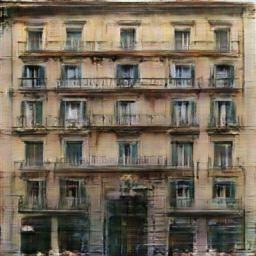

# pix2pix - Image to Image Translation Using Generative Adversarial Networks

This repository contains MATLAB code to implement the pix2pix image to image translation method described in the paper by [Isola et al. *Image-to-Image Translation with Conditional Adversarial Nets*](https://phillipi.github.io/pix2pix/).

- [Before you begin](#before-you-begin)
- [Getting started](#getting-started)
    - [Installation](#installation)
    - [Training a model](#training-a-model)
    - [Generating images](#generating-images)
- [Any problems?](#any-problems)
- [Finally](#finally)

## Before you begin

Make sure you have the minimum following requirements:

- MATLAB R2019b or greater
- Deep Learning Toolbox


## Getting started

### Installation


First off [clone](https://github.com/matlab-deep-learning/pix2pix.git) or [download](https://github.com/matlab-deep-learning/pix2pix/archive/master.zip) the repository to get a copy of the code. Then run the function `install.m` to ensure that all required files are added to the MATLAB path.

```matlab
install();
```

### Training a model

To train a model you need many pairs of images of "before" and "after". The classic example is the [facades dataset](http://cmp.felk.cvut.cz/~tylecr1/facade/) which contains label images of the fronts of buildings, and the corresponding original photo.


Use the helper function `p2p.util.downloadFacades` to download and prepare the dataset for model training. Once that's ready you will have two folders 'A' the input labels, and 'B' the desired output images. 

To train the model we need to provide the locations of the A and B images, as well as any training options. The model will then try and learn to convert A images into B images!

```matlab
[labelFolder, targetFolder] = p2p.util.downloadFacades();
```

We will just use the default options which approximately reproduce the setttings from the original pix2pix paper.

```matlab
options = p2p.trainingOptions();
p2pModel = p2p.train(labelFolder, targetFolder, options);
```

_Note that with the default options training the model will take several hours on a GPU and requires around 6GB of memory._


### Generating images

Once the model is trained we can use the generator to make generate a new image.

```matlab
exampleInput = imread("docs/labels.png");
```

We can then use the `p2p.translate` function to convert the input image using trained model. (Note that the generator we have used expects an input image with pixel dimensions divisible by 256)

```matlab
exampleOutput = p2p.translate(p2pModel, exampleInput);
imshowpair(exampleInput, exampleOutput, "montage");
```



For an example you can directly run in MATLAB see the [Getting Started](docs/getting_started.mlx) live script.

## Any problems?

If you have any trouble using this code, report any bugs, or want to request a feature please use the [GitHub issues](https://github.com/matlab-deep-learning/pix2pix/issues).

## Finally

This repository uses some images from the [facades dataset](http://cmp.felk.cvut.cz/~tylecr1/facade/) used under the [CC BY-SA licence](facades.rights)

_Copyright 2020 The MathWorks, Inc._